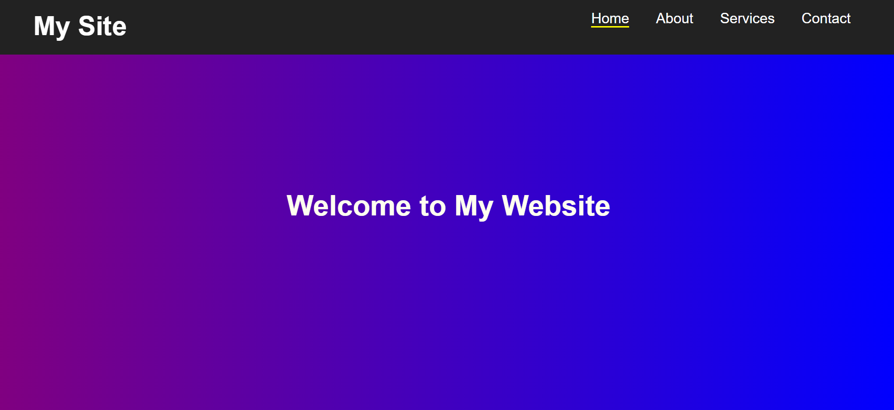

# Responsive Landing Page with Interactive Navbar

# 📌 Project Overview

This project is a fully responsive landing page designed using HTML, CSS, and JavaScript. It includes modern UI features like a dynamic navigation bar, smooth scrolling, animations, and mobile responsiveness.

---

# ✨ Features

- 📍 Fixed navigation bar (always visible)
- 🎨 Navbar color changes on scroll
- 🖱️ Hover effects on menu items
- ☰ Hamburger menu for mobile view
- 🌊 Smooth scrolling between sections
- ✨ Scroll-based fade-in animations
- 🎯 Active link highlighting

---
# 🛠️ Tech Stack

- HTML5 – Structure
- CSS3 – Styling & responsiveness
- JavaScript – Interactivity

---

# 📱 Responsive Design

The website is fully responsive and works smoothly on:

- Desktop 💻
- Tablet 📱
- Mobile 📱

---

📂 Project Structure

PRODIGY_WD_01/
│── index.html
│── style.css
│── script.js
│── projectscreenshot.png

---

# 🧠 Learnings

- DOM manipulation using JavaScript
- Handling scroll events
- Building responsive layouts using media queries
- Adding animations and transitions
---

# 🔗 Live Demo
https://suhani-sahu.github.io/PRODIGY_WD_01/

# 📸 Screenshot

---
# Author
Suhani Sahu

---

⭐ Feedback

Feel free to give suggestions or improvements
